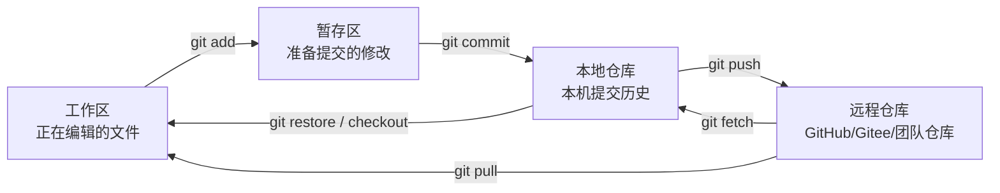
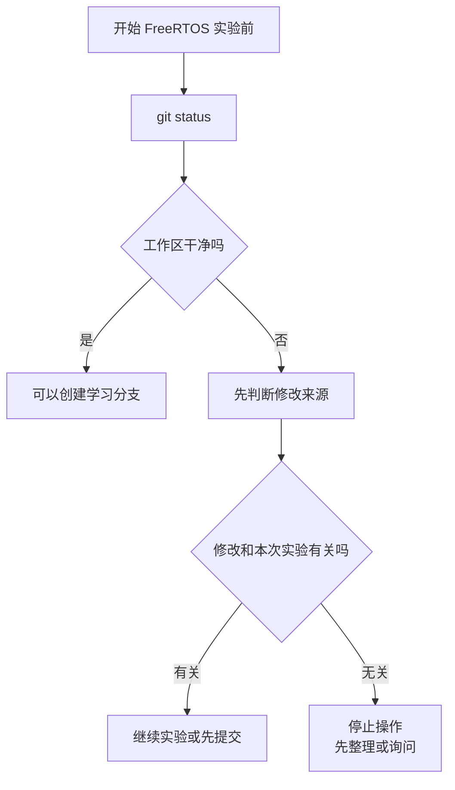
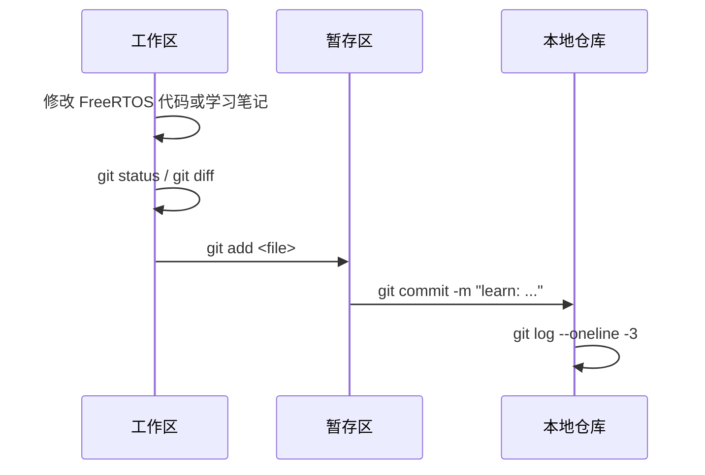
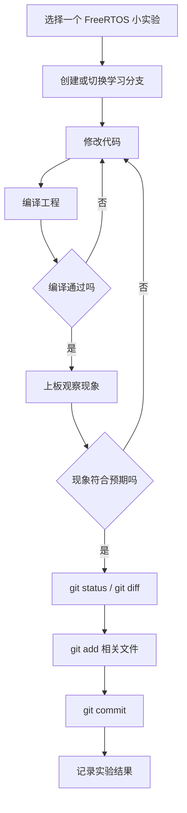
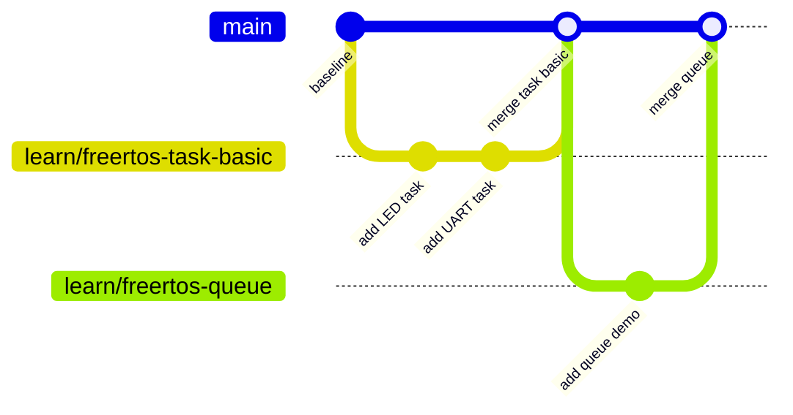
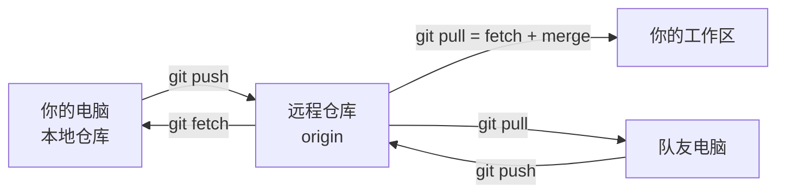
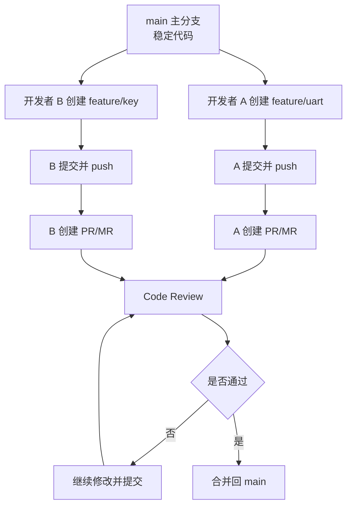
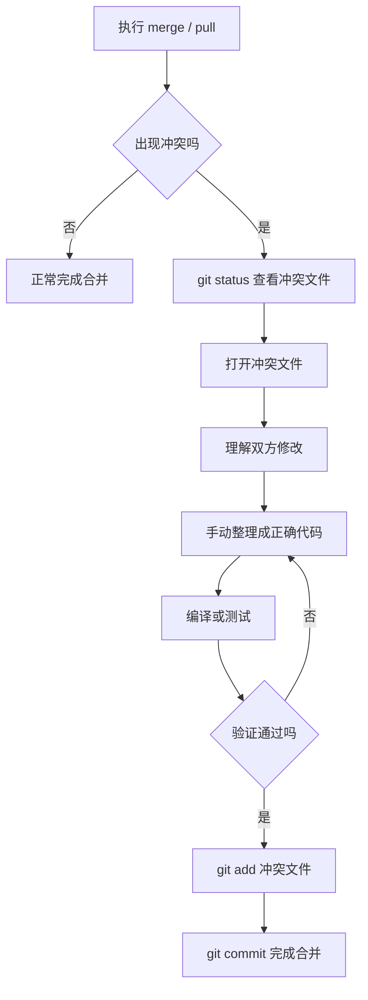
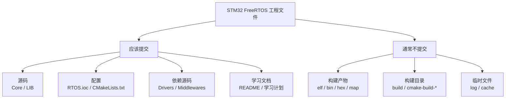

# Git 学习计划

本计划配合当前 FreeRTOS 学习使用。目标不是单独背 Git 命令，而是在每完成一个 FreeRTOS 学习进度时，用 Git 做好版本管理，逐步养成工程协作习惯。

当前工程环境：

- 工程路径：`F:\CLion\FreeRTOS_CUBEMX`
- FreeRTOS 工程路径：`F:\CLion\FreeRTOS_CUBEMX\RTOS`
- 主要学习代码：`RTOS/Core`、`RTOS/LIB`、`RTOS/Middlewares/Third_Party/FreeRTOS`
- 推荐主分支：`main` 或 `master`，以当前仓库实际分支为准
- 推荐学习分支前缀：`learn/`

## 学习目标

学完后你应该能做到：

- 看懂 Git 的工作区、暂存区、本地仓库、远程仓库。
- 每完成一个 FreeRTOS 小实验，就能独立完成一次规范提交。
- 会查看自己改了哪些文件、哪些代码。
- 会用分支隔离不同实验，避免把多个学习内容混在一起。
- 会把本地提交推送到远程仓库。
- 理解多人协作中的分支、合并、冲突、代码审查。
- 遇到常见 Git 问题时，能先保护现场，再决定怎么处理。

## Git 整体地图

先记住这张图。大部分 Git 命令，本质上都是在这几个区域之间移动代码。



| 区域 | 你可以理解为 | 常用命令 |
| --- | --- | --- |
| 工作区 | 你正在改的文件 | `git status`、`git diff` |
| 暂存区 | 下一次提交的候选内容 | `git add`、`git restore --staged` |
| 本地仓库 | 你电脑里的提交历史 | `git commit`、`git log` |
| 远程仓库 | 团队共享的仓库 | `git push`、`git pull`、`git fetch` |

## 阶段 G0：固定 Git 基线

目标：确认当前仓库状态清楚，后续所有 FreeRTOS 实验都从可控状态开始。

需要确认：

- 当前目录是 Git 仓库。
- 当前分支名称是什么。
- 当前是否有未提交修改。
- `.gitignore` 是否正确忽略构建产物、IDE 缓存和临时文件。

建议命令：

```text
git status
git branch
git log --oneline -5
```

重点理解：

- `git status` 是最常用的安全检查命令。
- 开始实验前，先确认仓库是否干净。
- 如果仓库已经有未提交修改，不要急着切分支或合并。
- 不确定文件是否该提交时，先问，不要随手 `git add .`。

通过标准：

- 能说清楚当前在哪个分支。
- 能说清楚当前有哪些文件被修改。
- 能判断这些修改是否和当前 FreeRTOS 实验有关。

G0 检查流程：



## 阶段 G1：本地仓库基础

目标：掌握一次最基本的“查看修改 -> 暂存 -> 提交”流程。

建议实验：

1. 修改一个学习笔记或 FreeRTOS 示例代码。
2. 使用 `git status` 查看文件状态。
3. 使用 `git diff` 查看具体修改。
4. 只暂存本次实验相关文件。
5. 写一条清楚的提交信息。

建议命令：

```text
git status
git diff
git add <file>
git commit -m "learn: add FreeRTOS task basic note"
```

重点理解：

- 工作区：你正在修改但还没暂存的内容。
- 暂存区：准备放进下一次提交的内容。
- 本地仓库：已经形成历史记录的提交。
- `git add <file>` 比 `git add .` 更适合学习阶段。

常见坑：

- 没看 `git diff` 就提交。
- 把无关文件一起提交。
- 提交信息只写 `update`、`fix`、`test`，以后看不懂。

一次本地提交可以这样看：



## 阶段 G2：配合 FreeRTOS 的提交习惯

目标：每完成一个 FreeRTOS 小进度，就生成一个清楚、可回退、可复盘的提交。

推荐提交节奏：

```text
FreeRTOS 阶段 0：固定工程基线 -> 1 次提交
FreeRTOS 阶段 1：任务基础 -> 2 到 4 次提交
FreeRTOS 阶段 2：队列 -> 1 到 3 次提交
FreeRTOS 阶段 3：信号量和事件标志 -> 2 到 3 次提交
FreeRTOS 阶段 4：互斥锁 -> 1 到 2 次提交
FreeRTOS 阶段 5：软件定时器 -> 1 到 2 次提交
FreeRTOS 阶段 6：中断 FromISR -> 1 到 3 次提交
FreeRTOS 阶段 7：内存、栈和调试 -> 2 到 4 次提交
FreeRTOS 阶段 8：综合项目 -> 按功能拆分多次提交
```

提交前检查清单：

```text
1. 这次实验目标是什么？
2. 我改了哪些文件？
3. 我是否看过 git diff？
4. 工程是否编译通过？
5. 板子上的现象是否符合预期？
6. 有没有无关文件混进来？
```

推荐提交信息：

```text
learn: confirm FreeRTOS project baseline
learn: add LED task demo
learn: add UART task demo
learn: compare FreeRTOS task priorities
learn: add queue communication demo
learn: add binary semaphore demo
learn: add event flags demo
learn: protect UART output with mutex
learn: add software timer demo
learn: notify task from button ISR
learn: inspect task stack usage
learn: add heap and stack debug hooks
learn: build FreeRTOS command controller demo
```

重点理解：

- 一个提交最好只表达一个清楚目标。
- “能编译”和“现象正确”是两件事，都要检查。
- 提交不是越少越好，清楚的小提交更适合学习和回退。

FreeRTOS 实验和 Git 提交的关系：



提交粒度示意：

| FreeRTOS 学习动作 | 推荐 Git 提交 |
| --- | --- |
| 工程能稳定编译 | `learn: confirm FreeRTOS project baseline` |
| LED 任务能周期运行 | `learn: add LED task demo` |
| UART 任务能周期打印 | `learn: add UART task demo` |
| 调整优先级并观察现象 | `learn: compare FreeRTOS task priorities` |
| 队列能传递按键事件 | `learn: add queue communication demo` |

## 阶段 G3：分支管理

目标：学会用分支隔离不同学习实验。

建议分支命名：

```text
learn/freertos-baseline
learn/freertos-task-basic
learn/freertos-queue
learn/freertos-semaphore
learn/freertos-event-flags
learn/freertos-mutex
learn/freertos-timer
learn/freertos-isr
learn/freertos-debug
learn/freertos-project
```

建议流程：

```text
git status
git switch main
git pull
git switch -c learn/freertos-task-basic
```

完成实验后：

```text
git status
git diff
git add <file>
git commit -m "learn: add FreeRTOS task basic demo"
```

合并回主分支：

```text
git switch main
git merge learn/freertos-task-basic
```

重点理解：

- 主分支保存稳定进度。
- 学习分支用于实验和试错。
- 一个分支最好对应一个 FreeRTOS 阶段或一个明确实验。
- 合并前先确认学习分支已经编译和验证通过。

常见坑：

- 在错误分支上写代码。
- 分支做得太大，最后很难合并。
- 没提交就切分支，导致修改被带到新分支。

分支管理图：



简单理解：

```text
main/master：保存稳定学习成果
learn/*：用来做某一个 FreeRTOS 实验
feature/*：多人协作时的具体功能开发
```

## 阶段 G4：远程仓库管理

目标：学会把本地学习成果同步到 GitHub、Gitee 或其他远程仓库。

建议命令：

```text
git remote -v
git fetch
git pull
git push
git push -u origin learn/freertos-task-basic
```

重点理解：

- `origin` 通常是默认远程仓库名称。
- `git fetch` 只获取远程变化，不自动合并。
- `git pull` 等于获取远程变化并尝试合并。
- 第一次推送新分支时通常需要 `-u origin <branch>`。

常见坑：

- 本地没有提交就想推送。
- 远程已有更新，本地直接推送失败。
- 分不清本地分支和远程分支。

通过标准：

- 能把一个 FreeRTOS 学习分支推送到远程。
- 能在远程仓库页面看到自己的提交记录。

本地和远程关系：



`fetch` 和 `pull` 的区别：

| 命令 | 做了什么 | 适合什么时候用 |
| --- | --- | --- |
| `git fetch` | 只下载远程更新，不改你当前代码 | 想先看看远程有什么变化 |
| `git pull` | 下载远程更新，并尝试合并到当前分支 | 确认要把远程变化合进来 |

## 阶段 G5：多人协作开发流程

目标：理解团队中如何用 Git 管理多人同时开发。

推荐协作流程：

```text
1. 从主分支更新最新代码。
2. 为自己的任务创建功能分支。
3. 在功能分支上开发并提交。
4. 推送功能分支到远程仓库。
5. 创建 Pull Request 或 Merge Request。
6. 其他人进行 Code Review。
7. 根据意见修改并继续提交。
8. 通过检查后合并进主分支。
9. 删除已经合并的临时分支。
```

角色理解：

- 开发者：负责在自己的分支上完成任务。
- Reviewer：负责看代码是否正确、清楚、可维护。
- Maintainer：负责合并代码，保证主分支稳定。

重点理解：

- 多人协作时，主分支不能随便直接提交。
- 合并前要先同步主分支最新代码。
- Code Review 不是找茬，而是共同降低风险。
- 提交要小而清楚，Reviewer 才容易看懂。

常见坑：

- 多个人直接改主分支。
- 长时间不拉取主分支，最后冲突很大。
- 一个 PR 包含太多无关修改。
- 只说“改好了”，但没有说明验证方式。

多人协作流程图：



多人协作角色表：

| 角色 | 做什么 | 关注点 |
| --- | --- | --- |
| 开发者 | 在自己的分支完成任务 | 小步提交、说明验证方式 |
| Reviewer | 审查代码和思路 | 是否正确、清晰、可维护 |
| Maintainer | 控制主分支合并 | 主分支是否稳定 |

## 阶段 G6：冲突解决

目标：遇到多人修改同一段代码时，能安全处理冲突。

冲突出现的典型场景：

- 两个人都修改了同一个函数。
- 一个改了文件名，另一个改了文件内容。
- 本地分支落后主分支太久。

建议处理流程：

```text
git status
打开冲突文件
找到 <<<<<<<、=======、>>>>>>> 标记
手动保留正确内容
重新编译或测试
git add <冲突文件>
git commit
```

重点理解：

- 冲突不是 Git 坏了，而是 Git 无法替你决定保留哪份代码。
- 解决冲突后一定要重新编译。
- 不理解冲突内容时，先停下来问，不要乱删。

常见坑：

- 只删除冲突标记，没有真正理解保留了哪份代码。
- 解决冲突后不编译。
- 把别人的修改误删。

冲突解决流程图：



冲突标记长这样：

```text
<<<<<<< HEAD
当前分支的内容
=======
要合并进来的内容
>>>>>>> other-branch
```

处理原则：

| 情况 | 建议 |
| --- | --- |
| 看得懂双方修改 | 手动合并成最终正确代码 |
| 看不懂对方修改 | 停下来问对方或让我帮你看 |
| 解决后能编译 | 再 `git add` 和 `git commit` |
| 解决后不能编译 | 不要急着提交，先修正 |

## 阶段 G7：嵌入式工程 Git 规范

目标：知道 STM32、CubeMX、CLion、CMake 工程中哪些文件应该提交，哪些不应该提交。

通常应该提交：

- `RTOS/Core`
- `RTOS/LIB`
- `RTOS/Drivers`
- `RTOS/Middlewares`
- `RTOS/CMakeLists.txt`
- `RTOS/CMakePresets.json`
- `RTOS/RTOS.ioc`
- `RTOS/cmake`
- 学习计划、实验笔记、README

通常不应该提交：

- 构建输出目录
- `.elf`、`.bin`、`.hex` 等生成物，除非明确需要归档发布
- IDE 临时缓存
- 日志文件
- 串口输出记录的临时文件

建议 `.gitignore` 覆盖：

```text
build/
cmake-build-*/
.idea/
*.elf
*.bin
*.hex
*.map
*.log
```

注意：

- `.ioc` 文件应该提交，因为它记录 CubeMX 配置。
- 第三方库是否提交，要看工程是否依赖本地源码构建。当前工程包含 STM32 HAL、CMSIS、FreeRTOS 源码，适合随工程保留。
- 不要为了“仓库干净”批量删除不理解的文件。

嵌入式工程文件分类：



## 推荐学习节奏

如果每天学习 1 到 2 小时，可以按下面节奏：

| 周次 | 内容 | 目标 |
| --- | --- | --- |
| 第 1 周 | Git 状态查看、本地提交、提交信息 | 能完成一次规范提交 |
| 第 2 周 | 分支管理、配合 FreeRTOS 小实验提交 | 能用分支管理不同实验 |
| 第 3 周 | 远程仓库、push、pull、fetch | 能同步本地和远程仓库 |
| 第 4 周 | 多人协作、PR/MR、Code Review | 理解团队开发流程 |
| 第 5 周 | 冲突解决、事故恢复、嵌入式 Git 规范 | 能处理常见协作问题 |

## 每次 FreeRTOS 实验的 Git 记录模板

建议每完成一个 FreeRTOS 实验，都记录下面几项：

```text
实验名称：
实验目标：
所在分支：
修改文件：
关键 Git 命令：
编译结果：
板上现象：
提交信息：
遇到的问题：
解决方法：
```

## 每次提交前的固定流程

```text
git status
git diff
cmake --build --preset Debug -j 6
git add <本次实验相关文件>
git status
git commit -m "<提交信息>"
git log --oneline -3
```

如果编译失败，不建议提交为正式学习进度。可以先修好；如果确实需要保存现场，提交信息要明确写出这是一个未完成状态，例如：

```text
wip: save queue demo draft
```

## 多人协作时的固定流程

开始任务：

```text
git switch main
git pull
git switch -c feature/<task-name>
```

开发中：

```text
git status
git diff
git add <file>
git commit -m "feat: <short description>"
```

提交给别人看：

```text
git push -u origin feature/<task-name>
```

合并前：

```text
git switch main
git pull
git switch feature/<task-name>
git merge main
```

## 学习时的判断标准

不要只问“命令会不会敲”，要用下面几个问题检查自己是否真的掌握：

- 我知道现在在哪个分支吗？
- 我知道当前工作区有没有未提交修改吗？
- 我知道这次提交包含哪些文件吗？
- 我能用一句话说明这次提交的目标吗？
- 我知道这次 FreeRTOS 实验是否编译通过吗？
- 我知道如何把这次学习成果推送到远程仓库吗？
- 如果和别人代码冲突，我能先保护现场再处理吗？

如果这些问题能回答清楚，Git 就不再只是命令，而是你的工程记录系统。

## 当前工程下一步建议

先完成 Git 阶段 G0：

1. 查看当前分支。
2. 查看当前未提交修改。
3. 判断这些修改分别属于哪个 FreeRTOS 实验或工程调整。
4. 不急着提交，先把每个修改的目的说清楚。

完成后，再开始 FreeRTOS 阶段 1 的学习分支，例如：

```text
learn/freertos-task-basic
```
